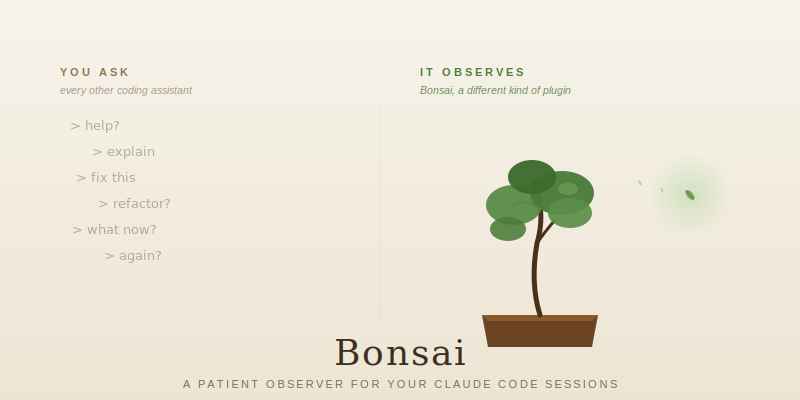

# Bonsai



**Claude answers when you ask. Bonsai notices when you don't.**

When you ask, you mostly catch what you remember to look for.

Bonsai is a Claude Code plugin that adds the missing half of the loop. After each turn of your session, a patient observer reads what just happened and emits a tiny, high-signal observation when (and only when) one is worth your time. A latent bug you missed. An architectural decision you made without noticing. A workflow pattern quietly costing you an hour a day.

It runs silently in the background. It says nothing most of the time. It speaks only when the signal is high. **Silence beats noise** is its hard rule.

## The proof

The first time the gardener ran on a real session (the transcript of building Bonsai itself), it caught two real bugs in its own codebase that sixteen rounds of code review during the build had missed:

1. `bonsai_branches_write` was the only non-atomic file write in a codebase that uses atomic patterns everywhere else. The gardener writes its own observations through that function. It surfaced the bug while writing its own report about it.
2. The CI workflow never triggered on release tags. That is exactly why two earlier releases shipped with a Linux compatibility regression.

Both fixed in v0.1.4. Both marked "kept" in the project's observation index. The loop closed in a single afternoon.

This is what proactive looks like.

## Why you want it

Claude is reactive by design. You ask, Claude answers, then Claude waits. The cost of that wait is invisible until you ship: the race condition you would have caught on Monday morning ships on Friday night. The architecture decision you made in a 3am haze becomes a six-month refactor. The small repetition in your workflow becomes a daily tax.

Bonsai closes the gap between the moment something matters and the moment you notice. You stop relying on remembering to ask. The observer remembers for you.

## Install

Inside Claude Code:

```
/plugin marketplace add ferdinandobons/bonsai
/plugin install bonsai@bonsai
```

Downloaded and enabled immediately. No restart needed.

<details>
<summary>Or: edit <code>~/.claude/settings.json</code> manually</summary>

```json
{
  "extraKnownMarketplaces": {
    "bonsai": {
      "source": { "source": "github", "repo": "ferdinandobons/bonsai" }
    }
  },
  "enabledPlugins": {
    "bonsai@bonsai": true
  }
}
```

Restart Claude Code or run `/plugin` to reload.

</details>

## Activate on a project

```bash
cd ~/your-project
/bonsai:start
```

That is the entire setup. Bonsai now watches this project silently. The minimum interval between checks is 5 minutes. Most checks produce zero observations, by design.

## Commands

**Watch**

| Command | Action |
|---|---|
| `/bonsai:start` | Start watching this project. Accepts `--throttle=Xm`, `--lenses=a,b,c`, `--model=name`. |
| `/bonsai:stop` | Stop watching (history preserved) |
| `/bonsai:mute <30m\|1h\|4h\|1d>` | Silence temporarily. Append `--global` for all projects. |
| `/bonsai:unmute` | Resume after a mute. Append `--global` to also clear a global mute. |

**Read**

| Command | Action |
|---|---|
| `/bonsai:status` | Health, quota, cost |
| `/bonsai:list [N=5]` | Read the N most recent open observations |
| `/bonsai:discuss <id>` | Talk through an observation in this session |

**Triage**

| Command | Action |
|---|---|
| `/bonsai:done <id>` | Mark as resolved / accepted |
| `/bonsai:dismiss <id> [reason]` | Mark as not useful. The gardener learns. |

**Config**

| Command | Action |
|---|---|
| `/bonsai:config [key value]` | View current config, or set one key |
| `/bonsai:help` | Full command reference |

## How it works

After each turn of Claude Code, a `Stop` hook script runs. It clears four gates in order: whitelist, mute, throttle, daily quota. If any gate fails, it exits silently with no effect on your session. If all pass, it dispatches a background subagent (the gardener) that:

1. Reads the recent session transcript.
2. Picks one of three lenses based on what just happened: **technical** (bug patterns, security risks, performance smells, test gaps), **strategic** (architectural decision points, scope creep, unanswered questions), **workflow** (repeated steps that should be automated, missing slash commands).
3. Generates between zero and three observations. Most of the time zero is the right answer.
4. Writes survivors to `.claude/bonsai/branches/<id>-<slug>.md` with full frontmatter and an action brief.
5. For `critical` severity: sends a push notification (rate-limited to 5 per hour per project).
6. For `critical` and `normal`: creates a clickable chip you can spin into a fresh task session.

Observations live as readable markdown files inside each project. Commit them to git if you want a team-shared journal, or gitignore them if you want them private. Your choice, project by project.

## Uninstall

Inside Claude Code:

```
/plugin uninstall bonsai@bonsai
/plugin marketplace remove bonsai
```

This removes the marketplace clone, cache, and settings entries. Your per-project observation logs (`.claude/bonsai/` inside each project) are preserved — delete them by hand if you want a clean slate.

## Privacy

Bonsai processes:

- Your Claude Code session transcript, via the standard transcript API.
- Files in your project modified since the last run.
- Optional: `git status` and `git diff --stat HEAD` when a `.git/` directory exists.

The gardener subagent runs through the LLM you have configured in Claude Code. No data leaves your machine beyond what your normal Claude Code usage already sends to your model provider.

Bonsai writes only inside `${CLAUDE_PROJECT_DIR}/.claude/bonsai/` and `${CLAUDE_PLUGIN_DATA}/`. It never modifies your project source files.

## Trust posture

- **Read-only on your code, always.** The gardener has no `Edit` tool.
- **Silent failure.** Every error path exits 0. Bonsai never disturbs a session, even when broken. Errors are written to `${CLAUDE_PLUGIN_DATA}/logs/bonsai-errors.log`.
- **File system is the source of truth.** Chips and push notifications are derivative. The markdown log under `.claude/bonsai/` always wins.

## License

Apache 2.0. See [LICENSE](LICENSE).

## Contributing

Issues and PRs welcome. See [CONTRIBUTING.md](CONTRIBUTING.md). Run `cd plugins/bonsai && bats tests/unit tests/integration` before submitting.

## Security

See [SECURITY.md](SECURITY.md) for the threat model and how to report vulnerabilities responsibly.

## Changelog

See [CHANGELOG.md](CHANGELOG.md). Latest: [v0.2.3](https://github.com/ferdinandobons/bonsai/releases/tag/v0.2.3).
